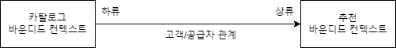
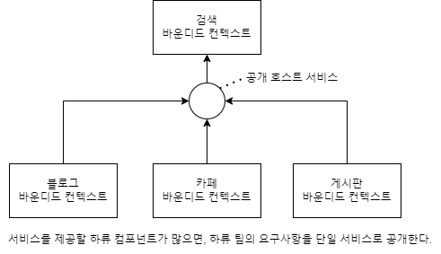
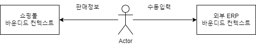
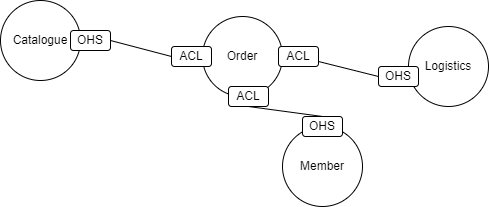

# 도메인 모델과 바운디드 컨텍스트

### 9.1 도메인 모델과 경계
- 도메인 모델 : `해결하고자 하는 문제영역(개념)`
  - 하나의 도메인 모델을 표현하기 위해서는, 여러 하위 도메인으로 구분된다.
- 각 도메인 모델에서, 표현 대상은 같으나, 용어/의미가 다르게 표현된다.
  즉, `하위 도메인에 따라 다른 용어`를 사용한다.
  - ex) 예를들어, 고객을 도메인 모델별로 다르게 표현 한다.
````
# 도메인별 쇼핑몰 고객 표현 방법이 여러개가 될 수 있다.

1. 회원 도메인 : 회원
2. 주문 도메인 : 주문자
3. 배송 도메인 : 수취인
... 
````
- 표현 대상이 같을지라도 도메인별 용어/의미 가 다르기 때문에,   
 `한 개의 모델을 통해, 전체 도메인 모델 의 하위 도메인을 표현하면 안된다.`  
  - 한 개의 모델을 통해 전체를 표현시 `도메인별`로 다른 요구사항을 반영하기가 힘들다.
  - 예제 
    1. 탈퇴회원이라도 배송에서의 고객은 유효한 고객으로 판단할 수 있다.
    2. 주문 도메인에서, 등급별 할인혜택이 추가 될 경우 타 도메인 모델에 필요없는 밸류들이 추가될 수 있다.
- `도메인 모델`은 `특정한 컨텍스트(문맥)` 에서 완전한 의미를 갖는다.
  - 이를 `DDD`에서는 `바운디드 컨텍스트`라 말한다.


### 9.2 바운디드 컨텍스트
- `바운디드 컨텍스트`
  - `도메인 모델`의 경계를 결정
  - 논리적으로 한개의 모델을 갖는다.
  - 하위 도메인과 바운디드 컨텍스트 1:1 관계가 가장 이상적이다.

- 한 개의 바운디드 컨텍스트가 여러 하위 도메인을 포함하더라도, 하위 도메인마다 구분되는 패키지를 갖도록 구현하는 것이 이상적이다.
  - ex) `고객` 은 `회원 도메인에서는 애그리거트 루트`, `주문 도메인에서는 밸류`가 된다.
````
# 물리적인 컨텍스트가 한 개 이더라도 내부적으로 패키지를 활용해
  논리적으로 바운디드 컨텍스트를 만든다.

온라인 쇼핑 바운디드 컨텍스트
1. 주문
2. 카탈로그
3. 회원
4. 배송
...
````

### 9.3 바운디드 컨텍스트 구현
- `바운디드 컨텍스트` 는 도메인 모델만 만이 아니라, `표현/응용/인프라 영역을 모두 포함` 한다.
  - 참고사항으로, DB 테이블도 바운디드 컨텍스트에 포함된다.
    - 도메인 모델 데이터 구조가 변경될시, DB 테이블 스키마도 변경 되어야 하기 때문
- 각 바운디드 컨텍스트는 `서로 다른 구현 기술을 사용 할 수 있다.`
    - 주문 컨텍스트에서는 RDB
    - 상품 페이지는 몽고
- 단순한 도메인 기능에 대해서는 서비스-DAO 로 구성되도 나쁘지 않다.
````
  #주문                 #리뷰
 표현 영역             표현 영역
    |                     |
 응용 서비스            서비스
    |                     |
  도메인                 DAO
    |                     |   
  인프라                 DBMS
    |                     
   DBMS  
````
- CQRS : 상태를 변경(저장/업데이트/삭제)하는 명령 기능과 내용을 조회하는 쿼리 기능을 위한 모델을 구분하는 패턴
````
             #주문
            표현영역(꽁유영역)
             (경계)
    응용서비스  |   서비스
      도메인    |   DAO 조회 전용 모델 
      인프라    |
               |
             저장매체(DBMS, 몽고)  
 
````
- REST API 형식
````
                    ↙----- 카탈로그 바운디드 컨텍스트(상품상정보)        
 브라우저(상품페이지)  
                    ↖----- 리뷰 바운디드 컨텍스트(리뷰내용)
````
- UI 서버
````
                                ↙----- 카탈로그 바운디드 컨텍스트(상품상정보)        
 브라우저(상품페이지) <-> UI 서버 
                                ↖----- 리뷰 바운디드 컨텍스트(리뷰내용)
````
### 9.4 바운디드 컨텍스트 간 통합
- 시나리오 : 카탈로그 시스템 하위 도메인에 `개인화 추천 기능` 도입
  - 카탈로그 하위 도메인에는 `기존 카탈로그 시스템` + `추천 기능` 컨텍스트가 개발 되어야함.
  - 상품 상세 페이지에, `기존 카탈로그` 데이터와 `추천 기능` 데이터가 한꺼번에 전달되어야 함.
````
# 카탈로그 하위 도메인
 > 카탈로그 컨텍스트 -> 추천 컨텍스트

1. 카탈로그는, 추천 컨텍스트로 부터 추천 제품 목록을 제공
2. 카탈로그 컨텍스트, 추천 도메인 모델은 서로 다르다.
3. 카탈로그 컨텍스트는 도메인 모델 구현, 추천은 연산을 위한 모델 구현
4. 카탈로그는 도메일 모델을 사용하여, 추천시스템을 표현해야 한다.
````
- 방법 1 : REST-API, 외부 시스템 도메인 모델과, 현재 도메인 모델 간의 변환을 한다.
````JAVA
      domain
         ↑
ProductRecommendationService(인터페이스, 객체 컨버팅)
         ↑
   RecSystemClient  <--> 외부 추천 시스템

public class RecSystemClient implements ProductRecommendationService {

  private ProductRepository productRepository = new ProductRepository();

  @Override
  public List<Product> getRecommendationsOf(ProductId id) {
    List<RecommendationItem> items = getRecItems(id.getId());
    return toProducts(items);
  }

  private List<RecommendationItem> getRecItems(String id) {
    //외부 추천 시스템 통신결과
    return Arrays.asList(
            new RecommendationItem("100"),
            new RecommendationItem("200"),
            new RecommendationItem("300")
    );
  }
  ## 외부 도메인 <-> 내부 도메인 컨버팅
  private List<Product> toProducts(List<RecommendationItem> items){
    return items.stream()
            .map(item -> toProductId(item.getItemId()))
            .map(productId -> productRepository.findById(productId))
            .collect(Collectors.toList());
  }
  private ProductId toProductId(String itemId){
    return new ProductId(itemId);
  }
}
````
- 방법 2 : REST-API, 외부 도메인 모델 <-> 내부 도메인 모델 컨버팅을 위해, 별도 클래스를 생성한다.
````JAVA
      domain
         ↑
    Translator(객체 컨버팅)
         ↑
ProductRecommendationService(인터페이스)
         ↑
   RecSystemClient  <--> 외부 추천 시스템
````
- 방법 3 : 간접 통합(REST-API는 직접 통합), 메세지 큐 사용
````JAVA

카탈로그 먼텍스트 <----메시징 시스템----> 추천 바운디드 컨텍스트

````

- 정리 : 각 컨텍스트의 필요한 모델들은 보통 다르기 때문에, 컨텍스트 별 데이터를 컨버팅 할수 있도록 협의를 통해 모델을 작성해야 한다.
  - 카탈로그 도메인 관점 데이터
    - ```` JAVA
      public class ViewLog {
        private ProductId id;
        private String userId;
        private LocalDateTime date;        
      }
      public class OrderLog {
        private ProductId id;
        private String userId;
        private Long price;
        private LocalDateTime date; 
      }
      ````
  - 추천시스템 도메인 관점 데이터
    -  ```` JAVA
        public class ActiveLog {
          private ProductId id;
          private String userId;
          private String activityType;
          private LocalDateTime actionDate; 
        }
        ````

### 9.5 바운디드 컨텍스트 간 관계
- 바운디드 컨텍스트는 다양한 방식으로 관계를 갖는다.
  - 보통 한쪽에서 API 제공, 다른 한쪽에서는 API를 호출(사용) 하는 관계이다.



````
상류 컴포넌트 : 서비스 공급자 역할
하위 컴포넌트 : 고객 역할
````
- 공급자 API가 변경된다면, 고객 API가 변경되어야 하는 경우가 많다.
  - 상류/하류 팀의 상호 협력이 필수적이다.


#### 바운디드 컨텍스트 관계 3가지
#### 1) 상류팀이 제공해야할 하류 컴포넌트가 여러개인 경우
- 상류 팀의 고객인 하류팀이 다수 존재하면, `상류 팀`은 `여러 하류팀의 요구사항들을 수용할 수 있는 단일 API 를 제공`하고 이를 서비스 형태로 공개하여, 서비스의 일관성을 유지하는 방식이다.
- 이러한 `형태를 공개 호스트 서비스`(OPEN HOST SERVICE) 라 칭한다.



- 주의할점은, 상류 서비스의 모델이 `자신의 도메인 모델에 영향을 주지 않도록` 해야한다. 즉, 다른 바운디드 컨텍스트에 타 도메인 모델이 자주 변경해서는 안된다.
````
# 안티코럽션 계층을 만들어, 바운디드 컨텍스트를 유지하도록 한다.
- 두 바운디드 컨텍스트간 모델변환 처리
  ex) 외부 추천시스템 상품코드와 카탈로그 시스템 상품코드 컨버팅
- 메시지 시스템을 통해 통합
````

#### 2) 두 바운디드 컨텍스트간 같은 모델을 공유하는 형태
- 두 팀이 공유하는 모델을 `공유커널`(SHARED KERNEL) 이라 한다.
````
잠점 : 개발 중복을 줄일 수 있다.
단점 : 하나의 모델을 공유하기 때문에, 모델을 공유하는 팀끼리 협업이 필수이다.
````

#### 3) 두 바운디드 컨텍스트간 통합하지 않는 형태
- 두 바운디드 컨텍스트를 통합하지 않는 형태를  `독립 방식`(SEPARATE WAY) 라고 한다.
- 두 컨텍스트 간의 통합은 수동으로 이루어진다.




### 9.6 컨텍스트 맵
- 전체 비지니스를 조망하는 관점이 필요하다.
- 이를 가능하게 하는것이 `컨텍스트 맵`이다.
````
`컨텍스트 맵`을 통해 이룰수 있는것들
- 시스템 전체 구조를 보여주기 때문에, 알맞은 바운디드 컨텍스트를 조절 할 수 있다.
- 핵심 도메인을 구분히여, 집중해야할 바운디드 컨텍스트를 선별 할 수 있다.
````


- `OHS` : 오픈 호스트 서비스, `ACL` : 안티코럽션 계층
- 이러한 `컨텍스트 맵`을 통해 `Order`라는 바운디드 컨텍스트는 카탈로그/배송/고객 의 바운디드 컨텍스트를 `Order 바운디드 컨텍스트`에 맞게 `컨버팅`을 하는것을 가시적으로 확인할 수 있다.