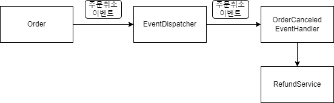
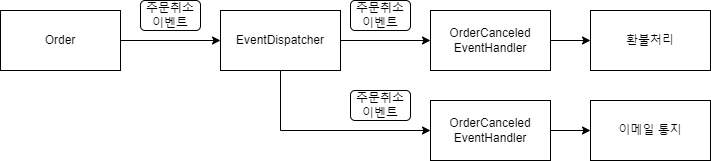

# 10. 이벤트

### 1. 시스템 간 강결합 문제
````JAVA
# 도메인 서비스를 주입받아 취소처리 

public class Order{
    ...
    //도메인 서비스를 파라미터로 전달받아 취소처리
    public void cancel(RefundService refundService){
        //주문 로직
        verifyNotYetShipped();
        this.state = OrderState.CANCELLED;
        //결제 로직
        this.refundStatus = State.REFUND_STARTED;
        try {
            refundService.refund(getPaymentId());  <-- 외부서비스 성능에 영향을 받음.
            this.refundStatus = State.REFUND_COMPLETED;
        }catch (Exception e){
            e.getMessage();
        }
    }    
}


- 주문 바운디드 먼텍스트, 결제 바운디드 컨텍스트의 강결합
 > 주문 로직과, 결제 로직이 섞이게 된다.
 > 취소로직에 새로운 기능이 추가될 때마다, 서비스를 새로 주입받아야 하며 복잡해지다.

````
````JAVA
# 응용 서비스에서 취소처리

public class CancelOrderService{
    private RefundService refundService;
    
    @Transactional
    public void cancel(OrderNo orderNo){
        Order order = findOrder(orderNo);
        order.cancel();
        order.refundStarted();
        try {
            refundService.refund(order.getPaymentId()); <-- 외부서비스 성능에 영향을 받음.
            order.refundCompleted();
        }catch (Exception e){
            e.getMessage();
        }
    }
}

- 외부서비스가 정상이 아닐경우의 트랜잭션 처리
- 환불을 처리하는 외부서비스에 직접적인 영향을 받게 된다.
 > 외부시스템에서 환불처리가 30초가 걸린다면, 취소 기능 처리시간이 30초간 들어난다.
````

- 이러한 강결합을 없앨 수 있는 방법이 `이벤트`를 사용하는 것이다.
- `비동기 이벤트`를 사용하면 두 시스템 간의 결합을 크게 낮출 수 있다.

### 2. 이벤트 개요
- `과거에 벌어진 어떤 것` 을 의미한다.
- 예를들어, 사용자가 암호를 변경한 것을 `암호를 변경했음 이벤트`가 발생했다고 표현할 수 있다.

#### 1. 이벤트 관련 구성요소
- 4가지
  - 이벤트, 생성 주체, 디스패처, 핸들러
  


- 이벤트 생성 주체
  - 엔티티/밸류/도메인서비스 에서 `상태가 바뀌면 이벤트를 발생`시킨다.(이벤트 발행)  

- 이벤트 디스패처
  - 이벤트 생성 주체 -> 이벤트 디스패처에 이벤트 전달 -> 핸들러에게 전달
  - 구현 방식에 따라 동기/비동기로 실행한다.  
  
- 이벤트 핸들러
  - 이벤트 생성 주체가 발생한 이벤트를 전달받아, 원하는 기능을 실행한다.
  - ex) 주문 취소 이벤트 발생시, 고객에게 SMS 통지

#### 2. 이벤트의 구성 
- 이벤트는 발생한 이벤트에 대한 정보를 담는다.
  - 이벤트 종류, 시간, 데이터

````JAVA
//이벤트 클래스
public class SHippingInfoCHangedEvent {
    private String orderNumer;
    private long timestamp;
    private ShippingInfo shippingInfo;
}

//이벤트 발행
public class Order{
    public void changeShippingInfo(ShippingInfo newShippingInfo){
        verifyNotYetShipped();
        setShipppingInfo(newShippingInfo);
        //디스페처를 통해, 이벤트를 전파
        Events.raise(new ShippingInfoChangedEvent(number, newShippingInfo));
    }
}

//이벤트 핸들러
public class ShippingInfoChangedHandler{

    @EventListener(ShippingInfoChangedEvent.class)
    public void handle(ShippingInfoChangedEvent evt){
        //이벤트 핸들러는 리포지토리, API 통신, DB 접근등을 통해 데이터를 조회할 수 있다.
        //Order order = orderRepository.findById(evt.getOrderNo());
        shippingInfoSynchronizer.sync(
                evt.getOrderNumber(),
                evt.getNewShippingInfo());
    }
}
````

#### 3. 이벤트 용도
- 2가지
  - 트리거 : 도메인 상태 변경시 후처리 실행
  - 다른 시스템간 동기화 : 이벤트를 통해 외부 시스템과 동기화 처리
  

#### 4. 이벤트 장점
- 도메인 로직이 섞이는 것을 방지 할 수 있다.
- 이벤트를 사용하여 결제 도메인 의존을 제거
- 확장 용이(이벤트 핸들러를 구현)
````JAVA
//이벤트 사용
public class Order{
    public void cancel(RefundService refundService){
        //주문 로직
        verifyNotYetShipped();
        this.state = OrderState.CANCELLED;
        //주문,결제 로직이 섞이지 않는다.
        Events.raise(new OrderCanceldEvent(orderId));
    }
}

public class OrderCanceldEvent{
    private long orderNumber;
}

//이벤트 핸들러
public class OrderCanceldEventHandler{

    @EventListener(OrderCanceldEvent.class)
    public void handle(OrderCanceldEvent evt){
        //이벤트 핸들러는 리포지토리, API 통신, DB 접근등을 통해 데이터를 조회할 수 있다.
        //확장 용이(이메일 통지 구현 등)
        shippingInfoSynchronizer.sync(
                evt.getOrderNumber());
    }
}
````



### 3. 이벤트, 핸들러, 디스패처 구현
- 이벤트 클래스 : 이벤트 표현
- 디스패처 : 스프링이 제공하는 ApplicationEventPublisher 사용
- Events : 이벤트 발행, ApplicationEventPublisher 사용
- 이벤트 핸들러 : 이벤트 수신 및 처리

#### 1. 이벤트 클래스
- 이벤트 클래스 생성시 유의사항
  - 과거에 벌어진 상태변화 및 사건을 의미, `클래스명 생성시, 과거 시제를 사용`한다.
  - 접미사로 Event를 사용
    - ex) OrderCanceledEvent
  - 이벤트 클래스는 최소한의 데이터를 포함해야한다.

````JAVA
# 이벤트 클래스
public class OrderCanceledEvent extends Event{
    private String orderNumber;
    
    public OrderCanceledEvent(String orderNumber){
        super();
        this.orderNumber = orderNumber;
    }
    public String getOrderNumber(){return orderNumber;}
}

# 이벤트 클래스가 공통 프로퍼티가 존재하면 상위클래스로 만든다.
public abstract class Event{
    private long timestamp;
    public Event(){
        this.timestamp = System.currentTimeMillis();
    }
}
````

#### 2. Events 클래스와 ApplicationEventPublisher
- 이벤트 발생을 위해 스프링에서 제공하는 ApplicationEventPublisher 를 사용한다.

````JAVA
public class Events {
    private static ApplicationEventPublisher publisher;

    static void setPublisher(ApplicationEventPublisher publisher) {
        Events.publisher = publisher;//Events 클래스가 사용할 이벤트를 전달받음.
    }

    public static void raise(Object event) {
        if (publisher != null) {
            publisher.publishEvent(event);//이벤트 발생
        }
    }
}

//이벤트 관련 설정
@Configuration
public class EventsConfiguration {
  @Autowired
  private ApplicationContext applicationContext;

  //Events 클래스 초기화
  @Bean
  public InitializingBean eventsInitializer() {
    return () -> Events.setPublisher(applicationContext);
  }
}
````

#### 3. 이벤트 발생과 이벤트 핸들러
````JAVA
//이벤트 발행
public class Order{
  ...
  public void cancel() {
    verifyNotYetShipped();
    this.state = OrderState.CANCELED;
    //이벤트 발생
    Events.raise(new OrderCanceledEvent(number.getNumber()));
  }
}

//이벤트 클래스
public class OrderCanceledEvent extends Event {
  private String orderNumber;

  public OrderCanceledEvent(String number) {
    super();
    this.orderNumber = number;
  }

  public String getOrderNumber() {
    return orderNumber;
  }
}

//이벤트 핸들러
@Service
public class OrderCanceledEventHandler {
  private RefundService refundService;//환불 서비스

  public OrderCanceledEventHandler(RefundService refundService) {
    this.refundService = refundService;
  }

  @EventListener(OrderCanceledEvent.class)
  public void handle(OrderCanceledEvent event) {
    refundService.refund(event.getOrderNumber());
  }
}
````
- Events.raise(new OrderCanceledEvent(number.getNumber())) 실행시,
  클래스 이름을 갖는 @EventListener 가 실행된다.

#### 4. 흐름 정리
````
응용 서비스 -> 도메인 기능실행 -> 도메인 -> rasie(event) -> Events 

````


1. 도메인 기능을 실행
2. Events.raise()를 통해 이벤트를 발생
3. Events.raise()는 ApplicationEventPublisher 를 이용해 이벤트를 출판.(디스패처)
4. ApplicationEventPublisher는 @EventListener(이벤트타입.class) 어노테이션이 붙은 메서드를 찾아 실행