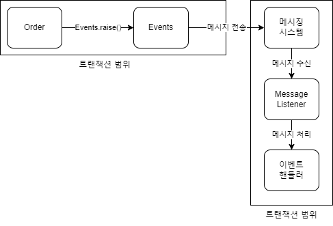
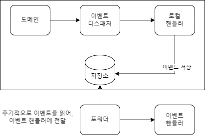
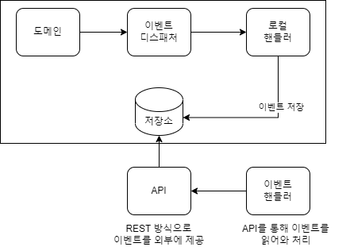

# 10. 이벤트

### 1. 시스템 간 강결합 문제
````JAVA
# 도메인 서비스를 주입받아 취소처리 

public class Order{
    ...
    //도메인 서비스를 파라미터로 전달받아 취소처리
    public void cancel(RefundService refundService){
        //주문 로직
        verifyNotYetShipped();
        this.state = OrderState.CANCELLED;
        //결제 로직
        this.refundStatus = State.REFUND_STARTED;
        try {
            refundService.refund(getPaymentId());  <-- 외부서비스 성능에 영향을 받음.
            this.refundStatus = State.REFUND_COMPLETED;
        }catch (Exception e){
            e.getMessage();
        }
    }    
}


- 주문 바운디드 먼텍스트, 결제 바운디드 컨텍스트의 강결합
 > 주문 로직과, 결제 로직이 섞이게 된다.
 > 취소로직에 새로운 기능이 추가될 때마다, 서비스를 새로 주입받아야 하며 복잡해지다.

````
````JAVA
# 응용 서비스에서 취소처리

public class CancelOrderService{
    private RefundService refundService;
    
    @Transactional
    public void cancel(OrderNo orderNo){
        Order order = findOrder(orderNo);
        order.cancel();
        order.refundStarted();
        try {
            refundService.refund(order.getPaymentId()); <-- 외부서비스 성능에 영향을 받음.
            order.refundCompleted();
        }catch (Exception e){
            e.getMessage();
        }
    }
}

- 외부서비스가 정상이 아닐경우의 트랜잭션 처리
- 환불을 처리하는 외부서비스에 직접적인 영향을 받게 된다.
 > 외부시스템에서 환불처리가 30초가 걸린다면, 취소 기능 처리시간이 30초간 들어난다.
````

- 이러한 강결합을 없앨 수 있는 방법이 `이벤트`를 사용하는 것이다.
- `비동기 이벤트`를 사용하면 두 시스템 간의 결합을 크게 낮출 수 있다.

### 2. 이벤트 개요
- `과거에 벌어진 어떤 것` 을 의미한다.
- 예를들어, 사용자가 암호를 변경한 것을 `암호를 변경했음 이벤트`가 발생했다고 표현할 수 있다.

#### 1. 이벤트 관련 구성요소
- 4가지
  - 이벤트, 생성 주체, 디스패처, 핸들러
  


- 이벤트 생성 주체
  - 엔티티/밸류/도메인서비스 에서 `상태가 바뀌면 이벤트를 발생`시킨다.(이벤트 발행)  

- 이벤트 디스패처
  - 이벤트 생성 주체 -> 이벤트 디스패처에 이벤트 전달 -> 핸들러에게 전달
  - 구현 방식에 따라 동기/비동기로 실행한다.  
  
- 이벤트 핸들러
  - 이벤트 생성 주체가 발생한 이벤트를 전달받아, 원하는 기능을 실행한다.
  - ex) 주문 취소 이벤트 발생시, 고객에게 SMS 통지

#### 2. 이벤트의 구성 
- 이벤트는 발생한 이벤트에 대한 정보를 담는다.
  - 이벤트 종류, 시간, 데이터

````JAVA
//이벤트 클래스
public class SHippingInfoCHangedEvent {
    private String orderNumer;
    private long timestamp;
    private ShippingInfo shippingInfo;
}

//이벤트 발행
public class Order{
    public void changeShippingInfo(ShippingInfo newShippingInfo){
        verifyNotYetShipped();
        setShipppingInfo(newShippingInfo);
        //디스페처를 통해, 이벤트를 전파
        Events.raise(new ShippingInfoChangedEvent(number, newShippingInfo));
    }
}

//이벤트 핸들러
public class ShippingInfoChangedHandler{

    @EventListener(ShippingInfoChangedEvent.class)
    public void handle(ShippingInfoChangedEvent evt){
        //이벤트 핸들러는 리포지토리, API 통신, DB 접근등을 통해 데이터를 조회할 수 있다.
        //Order order = orderRepository.findById(evt.getOrderNo());
        shippingInfoSynchronizer.sync(
                evt.getOrderNumber(),
                evt.getNewShippingInfo());
    }
}
````

#### 3. 이벤트 용도
- 2가지
  - 트리거 : 도메인 상태 변경시 후처리 실행
  - 다른 시스템간 동기화 : 이벤트를 통해 외부 시스템과 동기화 처리
  

#### 4. 이벤트 장점
- 도메인 로직이 섞이는 것을 방지 할 수 있다.
- 이벤트를 사용하여 결제 도메인 의존을 제거
- 확장 용이(이벤트 핸들러를 구현)
````JAVA
//이벤트 사용
public class Order{
    public void cancel(RefundService refundService){
        //주문 로직
        verifyNotYetShipped();
        this.state = OrderState.CANCELLED;
        //주문,결제 로직이 섞이지 않는다.
        Events.raise(new OrderCanceldEvent(orderId));
    }
}

public class OrderCanceldEvent{
    private long orderNumber;
}

//이벤트 핸들러
public class OrderCanceldEventHandler{

    @EventListener(OrderCanceldEvent.class)
    public void handle(OrderCanceldEvent evt){
        //이벤트 핸들러는 리포지토리, API 통신, DB 접근등을 통해 데이터를 조회할 수 있다.
        //확장 용이(이메일 통지 구현 등)
        shippingInfoSynchronizer.sync(
                evt.getOrderNumber());
    }
}
````


### 3. 이벤트, 핸들러, 디스패처 구현
- 이벤트 클래스 : 이벤트 표현
- 디스패처 : 스프링이 제공하는 ApplicationEventPublisher 사용
- Events : 이벤트 발행, ApplicationEventPublisher 사용
- 이벤트 핸들러 : 이벤트 수신 및 처리

#### 1. 이벤트 클래스
- 이벤트 클래스 생성시 유의사항
  - 과거에 벌어진 상태변화 및 사건을 의미, `클래스명 생성시, 과거 시제를 사용`한다.
  - 접미사로 Event를 사용
    - ex) OrderCanceledEvent
  - 이벤트 클래스는 최소한의 데이터를 포함해야한다.

````JAVA
# 이벤트 클래스
public class OrderCanceledEvent extends Event{
    private String orderNumber;
    
    public OrderCanceledEvent(String orderNumber){
        super();
        this.orderNumber = orderNumber;
    }
    public String getOrderNumber(){return orderNumber;}
}

# 이벤트 클래스가 공통 프로퍼티가 존재하면 상위클래스로 만든다.
public abstract class Event{
    private long timestamp;
    public Event(){
        this.timestamp = System.currentTimeMillis();
    }
}
````

#### 2. Events 클래스와 ApplicationEventPublisher
- 이벤트 발생을 위해 스프링에서 제공하는 ApplicationEventPublisher 를 사용한다.

````JAVA
public class Events {
    private static ApplicationEventPublisher publisher;

    static void setPublisher(ApplicationEventPublisher publisher) {
        Events.publisher = publisher;//Events 클래스가 사용할 이벤트를 전달받음.
    }

    public static void raise(Object event) {
        if (publisher != null) {
            publisher.publishEvent(event);//이벤트 발생
        }
    }
}

//이벤트 관련 설정
@Configuration
public class EventsConfiguration {
  @Autowired
  private ApplicationContext applicationContext;

  //Events 클래스 초기화
  @Bean
  public InitializingBean eventsInitializer() {
    return () -> Events.setPublisher(applicationContext);
  }
}
````

#### 3. 이벤트 발생과 이벤트 핸들러
````JAVA
//이벤트 발행
public class Order{
  ...
  public void cancel() {
    verifyNotYetShipped();
    this.state = OrderState.CANCELED;
    //이벤트 발생
    Events.raise(new OrderCanceledEvent(number.getNumber()));
  }
}

//이벤트 클래스
public class OrderCanceledEvent extends Event {
  private String orderNumber;

  public OrderCanceledEvent(String number) {
    super();
    this.orderNumber = number;
  }

  public String getOrderNumber() {
    return orderNumber;
  }
}

//이벤트 핸들러
@Service
public class OrderCanceledEventHandler {
  private RefundService refundService;//환불 서비스

  public OrderCanceledEventHandler(RefundService refundService) {
    this.refundService = refundService;
  }

  @EventListener(OrderCanceledEvent.class)
  public void handle(OrderCanceledEvent event) {
    refundService.refund(event.getOrderNumber());
  }
}
````
- Events.raise(new OrderCanceledEvent(number.getNumber())) 실행시,
  클래스 이름을 갖는 @EventListener 가 실행된다.

#### 4. 흐름 정리
````
응용 서비스 -> 도메인 기능실행 -> 도메인 -> rasie(event) -> Events 

````


1. 도메인 기능을 실행
2. Events.raise()를 통해 이벤트를 발생
3. Events.raise()는 ApplicationEventPublisher 를 이용해 이벤트를 출판.(디스패처)
4. ApplicationEventPublisher는 @EventListener(이벤트타입.class) 어노테이션이 붙은 메서드를 찾아 실행

### 4. 동기 이벤트 처리 문제
- 이벤트를 통해서 서로 다른 도메인 로직이 섞이는것을 방지 할 수 있다.
- 하지만, 외부 서비스에 영향을 받는 문제는 그대로 남아있을 수 있다.
  - 외부 서비스 응답이 느린경우
  - 외부 연동 익셉션에대한 트랜잭션 처리(트랜잭션을 계속 물고 있으면 db 컨넥션풀, 스레드풀 반환이 안된다.)

````java
//응용 서비스 코드
public class orderCancelService{
  @Transactional
  public void cancel(OrderNo orderNo){
    Order order = findOrder(orderNo);
    order.cancel();//OrderCanceledEvent 실행
  }    
}

//이벤트 핸들러
public class OrderCanceledEventHandler {
  private RefundService refundService;//환불 서비스

  public OrderCanceledEventHandler(RefundService refundService) {
    this.refundService = refundService;
  }

  @EventListener(OrderCanceledEvent.class)
  public void handle(OrderCanceledEvent event) {
    /**
     외부 인터페이스 취소 처리 부분
      1. 타 외부 서비스에 영향이 있을경우, 내부 시스템도 함께 영향을 받는다.
        > 성능저하, 트랜잭션 처리 
     */
    refundService.refund(event.getOrderNumber());
  }
}
````
- 해결 방안
  - `외부 시스템에 관련된 문제는 이벤트를 비동기로` 처리할 수 있다.
  - `이벤트를 트랜잭션과 연계처리` 한다.
    - EX) 내부 주문시스템의 취소 처리가 성공했을때, 이벤트를 실행시키는 방식

### 5. 비동기 이벤트 처리
- 비동기 이벤트 예시
  - 회원가입 후, 이메일 발송
  - 주문 취소 후, 결제 취소 처리  
  

#### 비동기 이벤트 구현방식 처리 4가지
````
1. 로컬 핸들러 비동기 실행
2. 메세지큐 사용
3. 이벤트 저장소와 이벤트 포워더 사용
4. 이벤트 저장소와 이벤트 제공 API 사용
````

#### 1. 로컬 핸들러 비동기 실행 
- 이벤트 핸들러를 비동기 실행
  - 별도 스레드가 이벤트 핸들러를 실행하게 처리
- 주문취소 스레드와 별도의 스레드로 처리함으로써 외부 시스템의 의존성을 제거

````JAVA
@EnableAsync : 스프링의 비동기 기능 활성화
@Async : 이벤트 핸들러에 비동기 어노테이션 추가
````
````java
@SpringBootApplication
@EnableAsync//스프링 비동기 활성화
@EnableJpaRepositories(repositoryBaseClass = RangeableRepositoryImpl.class)
public class ShopApplication {

    public static void main(String[] args) {
        SpringApplication.run(ShopApplication.class, args);
    }

}

# 로컬 핸들러를 사용했을시, 주문취소 스레드와 별도의 스레드로 처리함으로써 외부 시스템의 의존성을 제거.
@Service
public class OrderCanceledEventHandler {
  private RefundService refundService;

  @Async//비동기처리, 별도 스레드를 이용해서 비동기로 실행된다.
  @EventListener
  public void handle(OrderCanceledEvent event) {
    refundService.refund(event.getOrderNumber());
  }
}
````

#### 2. 메세징 시스템을 이용한 비동기 구현
- 카프카, 래빗MQ등 메세징 시스템을 이용
- 주문취소 스레드는 메세지를 보내는 역할만 진행을 하여, 외부 시스템에 대한 의존성을 제거함.
  - 메시징 시스템으로부터 타 어플리케이션에서 메세지를 수신하여 주문 취소처리
````
※ 메시징 시스템 연동시, 메시지 수신을 보장하는 시스템도 있다.
 > 대표적으로는 rabbit mq 이다.
 > 메시지 수신을 보장할 수 있지만, 글로벌 트랜잭션으로 인한 전체 성능저하가 일어날 수 있다.
 
※ 메시징 시스템 연동시, 동일 프로세스(동일 어플리케이션)에서 처리하는 것을 피하는것이 좋다.
 > 같은 JVM내에서 비동기 처리를 위해 메시지 큐를 사용하는 것은 시스템을 복잡하게 만든다.
````  

  

````
주문 어플리케이션 : 도메인 이벤트 발행(주문취소) -> 이벤트 핸들러가 메시지 시스템에 전달

메시지 시스템 : 주문 취소 이벤트를 수신하여, PG사에 결제 취소처리를 진행

Q : 메시지 발행 주체에서 전달해주는 메시지가 정상적으로 메세지 시스템에 전송이 안되면 어떻게 후처리를 해야할지.
Q : 주문 취소 이벤트가 실패시, 어떻게 처리할 수 있을지.
````

#### 3. 이벤트 저장소를 이용한 비동기 처리
- 처리할 `이벤트를 저장소(DB)에 저장`한 뒤 별도 프로그램을 이용하여, `이벤트 핸들러에 전달하는 방식`.
- 처리 방법 2가지 
  - `포워더` : `포워더`가 `이벤트 핸들러를 실행`하여 이벤트를 처리
  - `API` : `외부 이벤트 핸들러`가 `API를 호출`하여 처리.

````roomsql
- 이벤트 저장소
create table evententry (
  id int not null AUTO_INCREMENT PRIMARY KEY,
  `type` varchar(255),
  `content_type` varchar(255),
  payload MEDIUMTEXT,
  `timestamp` datetime
  boolean default false
);
````
````java
- 이벤트 객체
public class EventEntry {
  private Long id;
  private String type;
  private String contentType;
  private String payload;
  private long timestamp;
  private boolean success;
}
````

#### 1. 포워더 방식
- 포워더가 이벤트를 어디까지 처리했는지 추적
- 주문취소 스레드는, 주문취소 이벤트를 통해 취소 데이터를 저장소에 전달하는 역할이 끝.
- 실제 PG 주문 취소 처리는 포워더가 스케쥴링으로 처리한다.
````
1. 이벤트 발생 -> 핸들러를 통해 저장소에 저장
2. 포워더(별도의 스레드를 이용)가 주기적으로 이벤트를 저장소에서 끌어와 다른 이벤트 핸들러에게 전달하여 이벤트를 처리

※ 도메인과 포워더가 동일한 DB를 사용한다.(로컬 트랜잭션)
 
로컬 트랜잭션 : 로컬 트랜잭션(Local Transaction Processing)은 하나의 자원 관리자(데이터베이스)가 참여하는 트랜잭션이다.
전역 트랜잭션 : 전역 트랜잭션은 하나 이상의 자원 관리자(데이터베이스)와 하나 이상의 물리적인 사이트가 하나의 논리적인 단위로 참여하는 트랜잭션이다
```` 

````java
@Component
public class EventForwarder {
  private EventStore eventStore;//저장소로 부터 이벤트를 읽음
  private OffsetStore offsetStore;//이벤트를 어디까지 처리했는지에 대한 정보 조회
  private EventSender eventSender;//이벤트를 실제 발행
  
  //주기적으로 이벤트를 읽어, 이벤트 핸들러에 이벤트를 전달하며, 이벤트 처리 순번을 update 해준다.
  @Scheduled(initialDelay = 1000L, fixedDelay = 1000L)
  public void getAndSend() {
    long nextOffset = getNextOffset();//offset 읽기
    List<EventEntry> events = eventStore.get(nextOffset, limitSize);//저장소로 부터 이벤트 읽기
    if (!events.isEmpty()) {
      int processedCount = sendEvent(events); //이벤트 전달
      if (processedCount > 0) {
        saveNextOffset(nextOffset + processedCount);
      }
    }
  }
  //이벤트 전달 메서드
  private int sendEvent(List<EventEntry> events) {
    try {
      for (EventEntry entry : events) {
        eventSender.send(entry);//이벤트 핸들러가 처리
      }
    } catch(Exception ex) {
    }
    return processedCount;
  }
  //offset 업데이트
  private void saveNextOffset(long nextOffset) {
    offsetStore.update(nextOffset);
  }
}
````

#### 2. API 방식
- 주문취소 스레드는, 주문취소 이벤트를 통해 취소 데이터를 저장소에 전달하는 역할이 끝.
- 실제 PG 주문 취소 처리는 저장소를 반환하는 api통신을 통해 진행한다.
- 외부 핸들러가 API 서버를 통해 이벤트 목록을 가져간다.
- 이벤트 핸들러가 이벤트를 어디까지 처리했는지 추적

  

````java
//외부 핸들러
@Component
public class ExternalRefundService implements RefundService {
  @Override
  public void refund(String orderNumber) {
      HttpClient http = new HttpRequest();
      result = http.get("/api/events"+"?offset=0&limit=5");
      //.... 이벤트 처리
  }
}

@RestController
public class EventApi {
  private EventStore eventStore;

  @RequestMapping(value = "/api/events", method = RequestMethod.GET)
  public List<EventEntry> list(
          @RequestParam("offset") Long offset,
          @RequestParam("limit") Long limit) {
    return eventStore.get(offset, limit);
  }
}
````
````
Q : lastOffset 처리 방향에 대한 처리가 까다로울 것 같다. 방법을 공유해보면 좋을것같다.
Q : 비동기 처리방식의 API 방식은 어떻게 구현이될지 감이 잘 안잡힌다.
  > 외부 이벤트 핸들러를 어떻게 호출시킬수 있을까?
````
````
자동 증가 칼럼 주의 사항
- 여러 디비 트랜잭션이 진행중일때, 데이터 조회 시점에 따라 누락되는건들이 발생할 수 있다.
  예를들어, EventEntry id 1번 / 2번 이 커밋이전이고, id 3번이 우선 커밋될 상황이 발생할 수 있다. lastoffSet은
  3으로 업데이트가 되며, 1/2번에 대한 이벤트 처리는 누락될 수 있다.
  
  트랜잭션 격리 레벨을 높이거나 데이터 조회 시점과 최대 ID가 증가하는 시점에 차이를 둬야 한다
  CDC를 활용
````

### 6. 이벤트 적용 시 추가 고려사항

#### - 고려사항 5 가지
1. 이벤트 정보를 EventEntry(엔티티)에 넣을지 여부이다.
   1. 만약 이벤트를 EventEntry에 넣을경우, 이벤트 발행주체를 알수 있도록 정보를 추가해야한다.
      1. 주문 취소에 의한 이벤트인지, 고객 이메일 발송에 대한 이벤트인지 구분해야 한다.
2. 이벤트 처리시, `전송 실패를 얼마나 허용할 것인지`도 고려
   1. 포워더의 경우 특정 이벤트 전송 실패가 나면, 나머지 이벤트를 전송할 수 없게되기 떄문에 재전송 횟수 제한을 둔다.
   2. 실패한 이벤트를 실패용 DB나 메세지큐에 저장하기도 한다.
   3. 정책을 통해 실패나는 이벤트를 스킵한다.

3. `이벤트 손실 고려`
   1. 이벤트 저장소를 사용하면 이벤트 손실에 대한 걱정은 필요없다.(한 트랜잭션에 묶어 구현)
   2. 로컬 핸들러를 이용하여 이벤트를 비동기로 처리할 경우 이벤트 처리 실패시, 이벤트 유실 가능성
      1. 네트워크 오류로 메세지큐로 정상적으로 전달되지 않은 케이스가 있을 거 같다.
      2. 이벤트 처리 프로세스 로직중 오류
4. `이벤트 순서`
   1. 순서대로 이벤트를 외부 시스템에 전달해야 할 경우, 이벤트 저장소 방식이 좋다.
   2. 메세징 시스템은 이벤트 발생 순서와, 전달 순서가 다를 수 있다.
5. `이벤트 재처리`
   1. 동일한 이벤트에 대한 처리 방안
      1. 동일한 이벤트 발생시 스킵하기 등 정책을 통해 정하기

#### 1. 이벤트 처리와 DB 트랜잭션 고려

- 주문취소 이벤트 예제
````
1. 주문 취소 이벤트 발생
2. 이벤트 핸들러는 환불 처리 요청
3. 외부 API 호출하여 결제 취소 처리
````
````
이벤트 동기 처리
주문 취소 -> 주문 취소 이벤트 발행 -> 핸들러 -> 외부 시스템(취소처리) -> DB 커밋(취소완료)

이벤트 비동기 처리
주문 취소 -> 주문 취소 이벤트 발행 -> 핸들러 -> DB커밋(취소완료) | 이벤트 시스템 -> 외부 시스템(취소처리)
````

- 트랜잭션 실패, 이벤트 처리 실패를 모두 고려하면 복잡해짐
  - 트랜잭션 실패시, 이벤트를 전송하면 안된다.
  - 이벤트 처리 실패시, 트랜잭션도 롤백처리가 되어야한다.
  
- 따라서 트랜잭션이 성공할 때만 이벤트 핸들러를 실행하여, 경우의 수를 줄인다.(이벤트 처리 실패에대한 처리)
- @TransactionalEventListener : 스프링에서 제공하는 어노테이션
  - phase = TransactionPhase.AFTER_COMMIT : DB 트랜잭션 커밋 후, 이벤트 실행
````java
@TransactionalEventListener(
        classes = OrderCanceledEvent.class,
        phase = TransactionPhase.AFTER_COMMIT
)
public void handle(OrderCanceledEvent event) {
    refundService.refund(event.getOrderNumber());
}
````