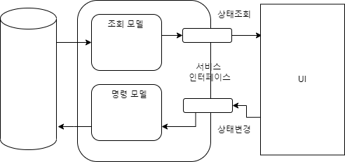
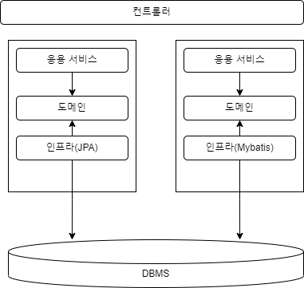
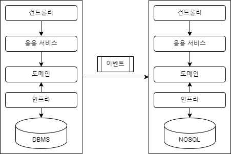

# 11. CQRS

### 1. 단일 모델의 단점
- 예를들어 주문내역 조회 기능 구현시, 여러 애그리거트에서 데이터를 가져와야 한다.
  - 즉시로딩 : 불필요한 정보까지 객체까지 함께 로딩할 수 있다.(고려할것이 많고, 구현이 복잡해짐)
  - 지연로딩 : 한번에 조회할 필요성이 있는 것들을 여러번에 나눠서 쿼리질의를 함.
    - 예를들어, 주문내역 1개당, 고객 엔티티를 조회,주문 상품내역 조회등 여러번 쿼리가 나갈 수 있다.

- 이러한 복잡도를 발생시키는이유
  - `시스템 상태변경 도메인`과 `조회 도메인`을 함께 사용하기 때문이다.
- 따라서 복잡도를 낮추기 위해, `상태변경을 위한 모델`과 `조회를 위한 모델`을 `분리`하는 것이 좋다.

### 2. CQRS
- 시스템이 제공하는 기능은 크게 두 가지로 나뉜다.
  - 첫번째, `상태를 변경하는 기능`(주문생성, 배송지 변경, 회원 암호 변경)
  - 두번째, `상태 정보를 조회하는 기능`(주문 내역, 게시글 목록, 회원 정보 등)

- `상태를 변경하는 기능`은 주로 `한 애그리거트`의 상태를 변경한다.
  - 주문 취소처리, 주문 배송지 변경 처리등 
- `상태 정보를 조회하는 기능`은 `두 개 이상의 애그리거트`가 필요할 때가 많다.
  - 주문내역 조회, 주문 배송지 내역 등

````
이러한 차이점으로 인해 조회성과 상태 변경 모델을 하나의 모델로 표현하면 불필요하게 복잡해진다.
이러한 문제를 해결하기 위해 사용하는 방법이 바로 `CQRS`이다.
````

  

- CQRS - command query responsibility segregation
  - `상태를 변경하는 모델`과 `상태를 조회하는 모델`을 분리하는 패턴이다.
  - 복잡한 도메인에 적합한 패턴이다.  
<br/>
- CQRS 구현
  - 명령 모델은 JPA, 조회모델은 mybatis
  - 서로 다른 데이터 저장소 사용(명령 모델은 RDBMS, 조회모델은 nosql)
    - 이벤트를 통하여 동기화
      - 처리목적에 따라 글로벌 트랜잭션 처리(예를들어, 주문취소는 즉각 고객에게 보여줘야하나 통계는 다소 지연이 있어도 된다.)

1. CQRS : 명령 모델과 조회모델 다른 기술 사용   
  

2. CQRS : 이벤트를 통한 동기화    


#### 1. 웹과 CQRS
- 일반적으로 상태변경 보다는 `상태를 조회`하는 요청이 많다.
  - 쿼리 최적화, 메모리 캐시 조회 등을 통해 응답속도를 높이는 형태로 서비스가 이루어진다.
- 명령 모델과 조회모델을 구분함으로써, `조회 기능에 특화된 구현기법`을 쉽게 적용할 수 있다.
#### 2. CQRS 장단점
장점 
1. 명령 모델 구현시, 도메인 자체에 집중 가능
2. 조회 성능을 향상시키는데 유리(조회 모델에 캐시적용, 조회에 특화된 쿼리 사용 등)
3. 조회모델을 별도로 사용하기 때문에, 명령 모델에는 영향을 주지 않는다.(강결합X)

단점
1. 구현해야할 코드가 많아진다.
2. 더 많은 구현기술이 필요하다.